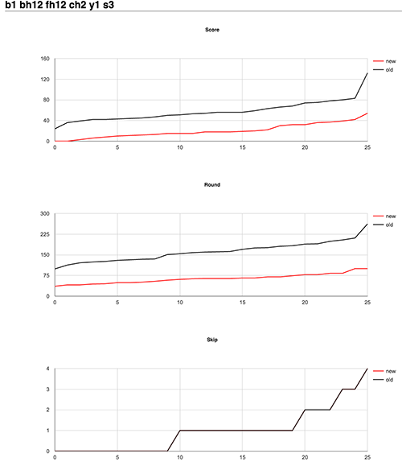

# T.E.T.R.I.S  AI

This is an experemental project for practicing algorithms writing in Go. Testing performance and eventially impliment machine learning. The idea is to write a "bot" that playing t.e.t.r.i.s by communicating with simple simulation framework.

##### NOTE: t.e.t.r.i.s speled with dots in order to prevent "competitors" to discover this source code when using github basic search.

### Simulation framework
In order to see how the "bot" performs in competitio, simple simulation framework has been written. Here is few available commands:

##### Play one game
Visual representation in a terminal of the "bot" playing preset game. Applying different strategy you can see different behavior and results

	go test -run=XXX -bench=one

##### Play many games
Visual representation in default browser (a graph) of "bot" playing many preset games using current strategy

	go test -run=XXX -bench=many

##### Generate random games
Generating an array of Pieces in random order. That can be used for preset game 

	go test -run=XXX -bench=generateGames

##### Generate random garbage rows
Generating an array of random numbers. That can be used to generate garbage rows 

	go test -run=XXX -bench=generateGarbageRows

##### Play diferent strategies
In order to find out the best combination of multipliers for the strategy. Play same games with diferent combination of multipliers and compare results.

	go test -run=XXX -bench=strategy -timeout=12h

### Testing
Usual Go testing. Just execute this command:

	go test

### Benchmark
Benchmark tests implimented for core functions. That helps to track improvements in optimization of algorithms and strategies.

##### FindPositions
Current result is: 2000	    788343 ns/op

	go test -run=XXX -bench=FindPositions

##### CalculateMoves
Current result is: 100	  13142213 ns/op  Must always be bellow 500ms

	go test -run=XXX -bench=CalculateMoves

### TODOs
##### Impliment better skip strategy (check next piece lowest Score)